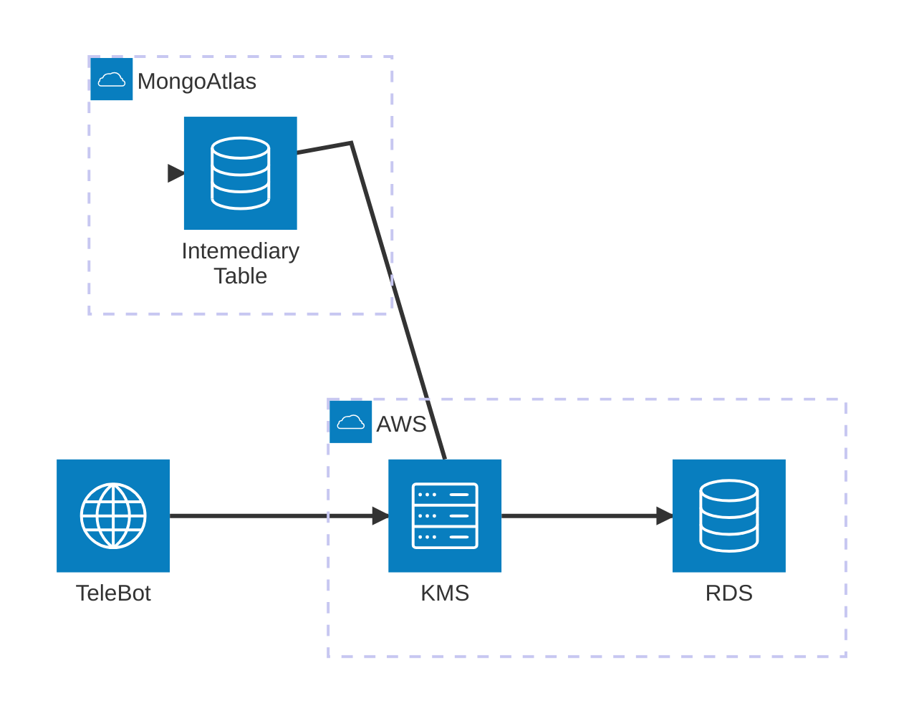
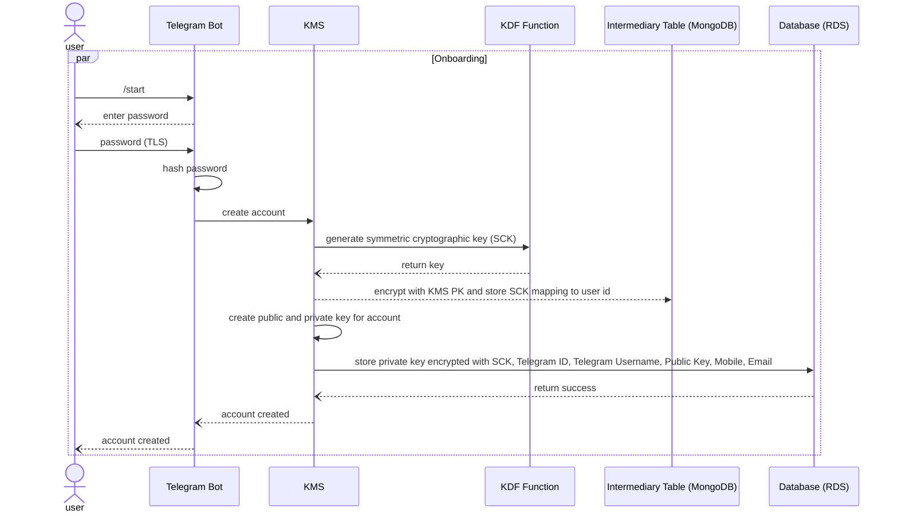

# Key Management System (KMS)

## Overview

This project is a **Key Management System (KMS)** designed to securely manage and store private keys, public keys, and other sensitive cryptographic data. It integrates with Telegram to provide users with a Web2-like experience while leveraging Web3 capabilities such as blockchain transactions and wallet management.

The KMS is part of a system that allows Telegram users to:

1. Initialize their own blockchain wallets through a Telegram bot.
2. Securely manage private keys without direct user interaction.
3. Use a blockchain name service to map Telegram usernames to wallet addresses.
4. Send and receive cryptocurrency seamlessly via Telegram commands.

---

## Features

- **Secure Private Key Storage**: Private keys are encrypted with a password-derived symmetric key and stored securely.
- **Blockchain Name Service**: Maps Telegram usernames to blockchain wallet addresses.
- **Wallet Management**: Generates wallets (private/public key pairs) for users.
- **Password-Based Encryption**: Protects private keys with user-provided passwords, hashed and processed securely.
- **KMS-Assisted Recovery**: Provides a fallback recovery option for encrypted symmetric keys.
- **Integration with Web3.js**: Enables blockchain interaction for wallet creation, balance queries, and transactions.
- **Scalability**: Designed to support thousands of users with efficient key and transaction management.

---

## Security Considerations

### Private Key Security

1. **Password-Derived Encryption**:

   - When a wallet is created, the private key is encrypted using a symmetric key derived from the user's password via a Key Derivation Function (KDF) like PBKDF2 or Argon2.
   - The symmetric key (SCK) is stored encrypted with the **KMS public key**, ensuring it can be recovered without the user's password.

2. **Transport Security**:

   - All communications between the Telegram bot and the backend are encrypted with HTTPS/TLS to prevent eavesdropping.

3. **KMS-Assisted Recovery**:

   - If a user forgets their password:
     - The KMS uses its private key to decrypt the stored symmetric key (SCK).
     - The SCK is then used to decrypt the private key.
   - This mechanism ensures the user can recover their wallet without their password or seed phrase.

4. **Rate-Limiting and Abuse Prevention**:

   - Implement rate-limiting for recovery requests to prevent brute-force attacks on encrypted symmetric keys.

5. **Audit Logging**:
   - All recovery and decryption actions are logged for monitoring and forensic analysis.

---

## User Workflow

1. **Onboarding**:

   - User sends `/start` to the Telegram bot.
   - The bot prompts the user to create a password.
   - A wallet is generated, and the private key is encrypted with a password-derived symmetric key.

2. **Sending Cryptocurrency**:

   - User sends `/send @username <amount>` to transfer funds.
   - The bot retrieves the recipient's wallet address, decrypts the sender’s private key using the SCK, and signs the transaction.

3. **Password Recovery**:

   - If the user forgets their password:
     - The KMS decrypts the SCK using its private key.
     - The SCK decrypts the private key, restoring access to the wallet.

4. **Querying Balance**:
   - User sends `/balance` to check their wallet balance.
   - The bot interacts with the blockchain to fetch and display the balance.

## Architecture



## Sequence Diagram



## Technologies Used

- **Express with TypeScript**: Backend framework for the KMS.
- **Web3.js**: For blockchain wallet management and interactions.
- **PostgreSQL / MongoDB**: To store user and cryptographic data securely.
- **Telegram Bot API**: For user interactions and command handling.
- **Encryption**:
  - AES-256 for symmetric key encryption.
  - PBKDF2/Argon2 for password-derived keys.

---

## Development Setup

### Prerequisites

- **Node.js**: Install [Node.js](https://nodejs.org).
- **MongoDB** or **PostgreSQL**: Setup a database for storing user and cryptographic data.
- **Telegram Bot**: Create a bot using the [Telegram Bot API](https://core.telegram.org/bots/api).
- **Environment Variables**: Configure sensitive information in a `.env` file.

### Installation

1. Clone the repository:
   ```bash
   git clone https://github.com/your-username/your-repo-name.git
   cd your-repo-name
   ```
